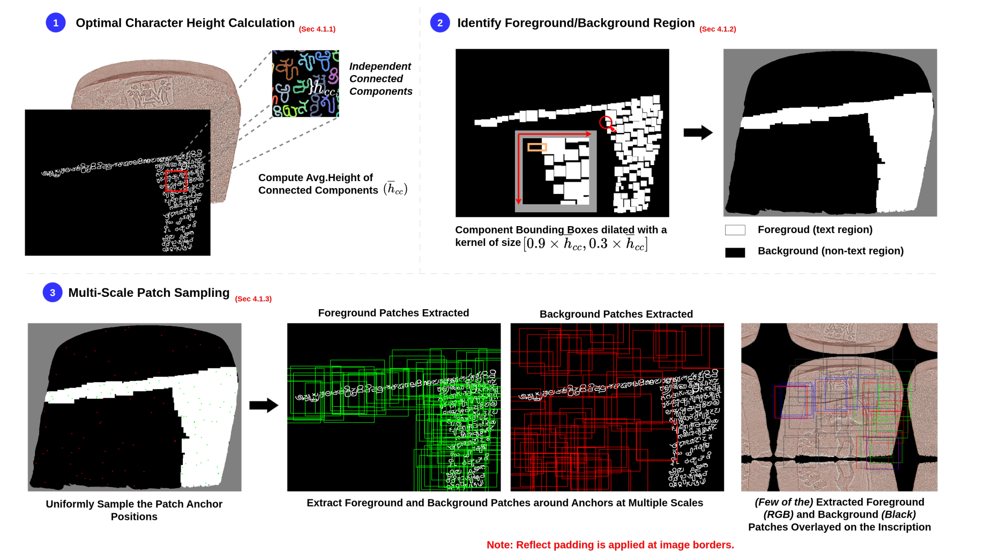

# Unveiling Text in Challenging Stone Inscriptions: A Character-Context-Aware Patching Strategy for Binarization

This is the official repository for the paper "Unveiling Text in Challenging Stone Inscriptions: A Character-Context-Aware Patching Strategy for Binarization".

## Table of Contents
- [File Structure](#file-structure)
- [Setup and Installation](#setup-and-installation)
- [Usage](#usage)
  - [1. Dataset Creation](#1-dataset-creation)
  - [2. Model Training](#2-model-training)
  - [3. Inference](#3-inference)
- [Citation](#citation)

## Overview of Character-Context-Aware Patching



## File Structure

The project is organized into several key directories and scripts. Here is a description of the recommended file structure:

```
.
├── Unet/
│   ├── dataset.py
│   ├── fast_dibco_metrics.py
│   ├── losses.py
│   └── model.py
├── binarized_masks/
│   ├── image1.png
│   ├── image1_mask.png
│   └── ...
|
├── Dataset_512/
│   ├── train/
│   │   ├── images/
│   │   └── masks/
│   └── val/
│       ├── images/
│       └── masks/
├── Create_dataset.py
├── Inference.py
├── Train.py
├── Dataset_split.json
└── README.md
```

### Directory Descriptions

*   `Unet/`: Contains the core components of the U-Net model architecture, including the dataset loader (`dataset.py`), evaluation metrics (`fast_dibco_metrics.py`), loss functions (`losses.py`), and the model definition (`model.py`).
*   `binarized_masks/`: This is the **input directory for `Create_dataset.py`**. It should contain your original document images and their corresponding ground truth binary masks, *the directory path can be changed inside Create_dataset.py*.
*   `model_checkpoints/`: This directory is for **storing the trained model weights**. The `Train.py` script will save checkpoints here.
*   `test_images/`: The **input directory for the `Inference.py` script**. Place the document images you want to binarize here.
*   `Train_Dataset_512/`: The **output directory for `Create_dataset.py`** and the **input directory for `Train.py`**. It will contain the generated image and mask patches for training and validation.
*   `Dataset_split.json`: A JSON file that defines the train, validation, and test splits for your dataset. This file is used by `Create_dataset.py` to organize the data.

## Setup and Installation

1.  **Clone the repository:**
    ```bash
    git clone <link>
    cd <repo>
    ```

2.  **Create a Python virtual environment (recommended):**
    ```bash
    conda create -n context_bin python=3.11 -y
    conda activate context_bin
    ```

3.  **Install the required dependencies:**
    ```bash
    pip install -r requirements.txt
    ```

## Usage

The workflow is divided into three main steps: dataset creation, model training, and inference.

### 1. Dataset Creation

The `Create_dataset.py` script generates patches from your original images and masks to create a dataset suitable for training the U-Net model.

**Prerequisites:**

*   Place your original images and their corresponding binary masks in the `binarized_masks/` directory.
*   Create a `Dataset_split.json` file that specifies which images to use for training, validation, and testing. *In the repository the provided Dataset_Split.json file contains all the test images used in the paper*

**How to run:**

You can run the script with its default settings:

```bash
python Create_dataset.py
```

This will generate a `Train_Dataset_512` directory with the training and validation patches.

**Command-line arguments:**

You can customize the dataset creation process using the following arguments:

*   `--image_dir`: Path to the directory containing the original images (default: `./binarized_masks`).
*   `--gt_dir`: Path to the directory containing the ground truth masks (default: `./binarized_masks`).
*   `--output_dir`: Path to save the generated patches (default: `./Train_Dataset_512`).
*   `--output_size`: The final size of the generated patches (default: `512`).
*   `--h_range`: Range of character height multipliers for dynamic patch sizing (default: `4 12`).
*   `--base_rate`: Number of patches to generate per 10 valid characters (default: `5`).
*   `--min_patches`: Minimum number of patches per image (default: `10`).
*   `--max_patches`: Maximum number of patches per image (default: `250`).
*   `--max_bg_patches`: Maximum number of background patches to sample (default: `75`).

### 2. Model Training

The `Train.py` script trains the Attention U-Net model on the dataset created in the previous step.

**Prerequisites:**

*   A generated dataset in the `Train_Dataset_512` directory from the `Create_dataset.py` script.

**How to run:**

To start training with default parameters:

```bash
python Train.py
```

To enable Weights & Biases logging:

```bash
python Train.py --wandb
```

**Command-line arguments:**

*   `--epochs`: Number of training epochs (default: `50`).
*   `--batch-size`: The batch size for training (default: `16`).
*   `--learning-rate`: The learning rate for the optimizer (default: `1e-4`).
*   `--data-dir`: The directory of the training data (default: `./Train_Dataset_512`).
*   `--loss`: The loss function to use. Options are "bce", "dice", "focal", "dice_bce", "sam" (default: `dice_bce`).
*   `--amp`: Enable automatic mixed precision for faster training.
*   `--wandb`: Enable logging with Weights & Biases.

### 3. Inference

The `Inference.py` script performs binarization on new images using the trained model.

**Prerequisites:**

*   A trained model checkpoint (e.g., `best_model.pth`) in the `model_checkpoints/` directory.

**Configuration:**

Before running, you need to configure the paths inside the `Inference.py` script. Open the `main` function and set the following variables in the `config` dictionary:

*   `'MASK_DIR'`: Path to the ground truth masks for the test images (for evaluation).
*   `'MODEL_PATH'`: Path to your trained model checkpoint.
*   `'OUTPUT_DIR'`: The directory where the binarized images and other outputs will be saved.
*   `input_dir` (at the top of the `main` function): Path to your test images.

**How to run:**

Once configured, run the script:

```bash
python Inference.py
```

The script will process each image in the `input_dir` and save the binarized output in the specified `OUTPUT_DIR`.

## Citation

If you use this code in your research, please cite our paper:

```
[To be filled]
```

## License

This project is licensed under the MIT License - see the [LICENSE](LICENSE) file for details.